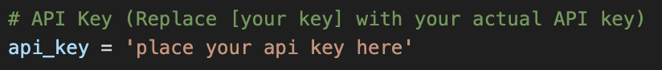
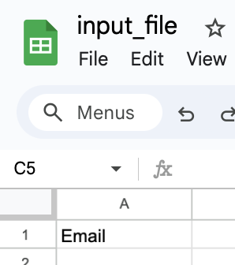
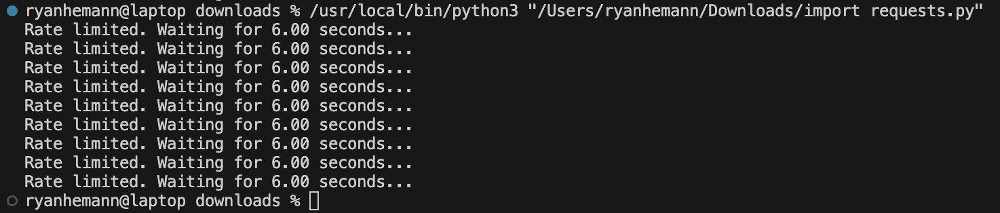
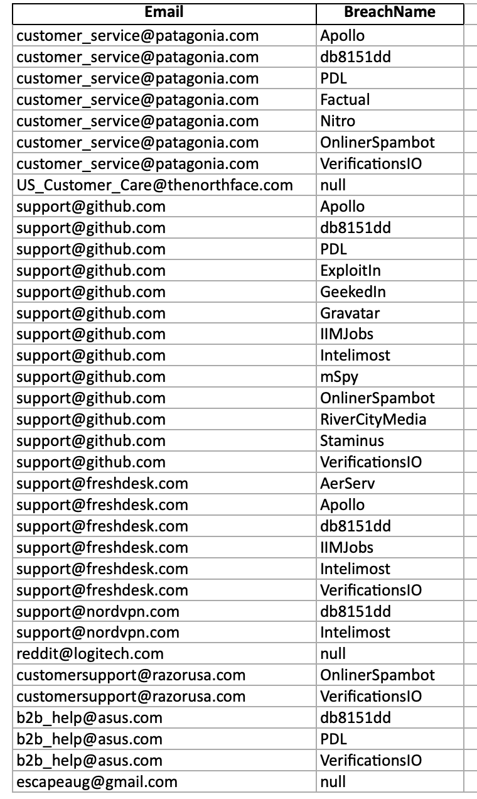

# Email PwnCheck Automator Tool

## Project Description:

The Email PwnCheck Automator is a Python tool designed to aid security professionals by automating the process of checking email addresses for security breaches. It leverages the 'Have I Been Pwned' service to search for breached email accounts and updates the results to an .xlsx spreadsheet. This project utilizes Python for scripting and the pandas library for data manipulation, and it is integrated with the Have I Been Pwned API. The tool significantly reduces manual effort and human error in monitoring email security, enhances proactive breach detection, and ensures data integrity by automating the update of breach information into the generated .xlsx spreadsheet report.

## Table of Contents:

- Project Description
- Table of Contents
- Installation
- Usage
- Features
- Examples

## Installation:

### PwnCheck Automator Installation Manual:

This installation manual guides you through setting up the PwnCheck Automator, a Python tool to automate email security breach checks using the Have I Been Pwned service and update an .xlsx spreadsheet with the results.

#### Prerequisites:

1. **Install Code Editor:** Ensure you have a code editor installed. You are welcome to use your preference here. In this demonstration, I will be using VisualStudio Code. If you currently don't have a code editor installed, download and install VisualStudio Code from [Visual Studio's Website](https://code.visualstudio.com/).

2. **Install Python:** Ensure you have Python installed. Download and install Python from [python.org](https://www.python.org).

3. **Install Pip:** Make sure you have pip (Python package manager) installed. It is usually included with Python. To check, open your IDE terminal/command prompt and run:

pip --version

If not installed, you can install it following the [official guide](https://pip.pypa.io/en/stable/installation/).

4. **API Key:** Obtain an API key from Have I Been Pwned (HIBP). Visit [haveibeenpwned.com/API/Key](https://www.haveibeenpwned.com/API/Key) and follow the instructions to get your key. For this demonstration, I have chosen the $4/month plan.

#### Installation Steps:

1. **Download the PwnCheck Automator Script:**
- Clone or download the PwnCheck Automator project from its Github repository.

2. **Navigate to the Project Directory:**
- Using your terminal or command prompt, change your working directory to the folder where you downloaded the project. For example:

cd /path/to/pwncheck-automation

3. **Install Python Dependencies:**
- Run the following command to install the necessary Python libraries (pandas and requests):

pip install pandas requests

4. **Edit Configuration:**
- Open the config.py file in the project directory and add your HIBP API key:

API_KEY = 'YOUR_API_KEY_HERE'

5. **Prepare the Input File:**
- Create an .xlsx spreadsheet (e.g., input_file.xlsx) with a column 'A1' labeled "Email" containing the email addresses you want to check.

6. **View the Output:**
- Once the script finishes, you'll find the updated ..xlsx file in the same directory with a new filename (e.g., output_file_TIMESTAMP.xlsx).

## Usage:

Once you have all the prerequisites complete and you have your script operational on your machine, you will have to feed it an input file. This will be done by creating an .xlsx file (in either Google Docs or Microsoft Word).
In the location A1, input 'Email' or exactly as has you have it written in your python script.
Load in all the emails you would like to check in A column starting at A2.
Save the file as whatever you have named your input file in the Automator script and ensure it is saved in the working directory of the script.
Run the script, it should look something like this if it's working:

Once the script finishes, the output file should look something like this:

## Features:

## Examples:
